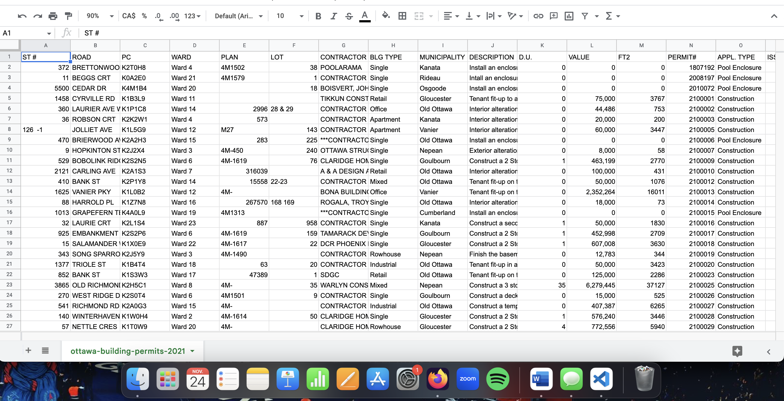
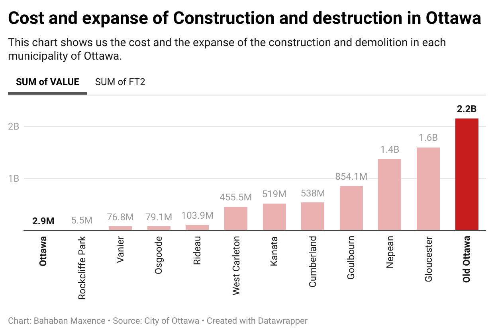

**25 novembre 2022** 
**JOU4100 Digital journalism** 
**Bahaban Maxence** 
**Presented to Jean-Sébastien Marier** 

# Project 2: Basic Data Analysis & Visualization

## 1. Introduction
The data studied is about the construction, demolition, and pool enclosure permits issued in 2021. In this dataset, according to the City of Ottawa, there is information about the "address, ward, former municipality, postal code, plan and lot number, dwelling unit counts, value and area of construction or demolition work, contractor, building type, application type and permit issued date, and description of the work being completed."  
This dataset was published the 22 february 2021 by the City of Ottawa. Since the city of Ottawa is the one issuing thoses permits, the dataset was collected directly from there documents.
[Acces to the dataset](https://open.ottawa.ca/documents/ottawa::construction-demolition-and-pool-enclosure-permits-monthly-2021/about)
 
We are going to treat this dataset to make it usabale for a data-driven story. 

## 2. Getting Data

### 2.1 Importing the data
- To import data manually like I did with this dataset, you need to download the original dataset. Then You will open a new sheet, you can do that by putting "sheets.new" in the url sherch bar. After that, you only have to go to file, import and select the dataset. 
 
*Figure 1: The google sheets file just after importing the data.* 
[Here is my Google sheets spreadsheets](https://docs.google.com/spreadsheets/d/1hGx2mYTcL1z6ZdKgt42-8ynBpeRSmPZ1Ty0gDs2YfyE/edit?usp=sharing)
If you want to automatically import data, you can use one of the command available like`IMPORTHTML` or `IMPORTXML`. 
### 2.2 Obesrvations about the data 

In the dataset imported, we can see that it contains 14,077 rows and 16 columns. Moreover the data doesn't seem clean and contains some blank spaces, some missing data and numbers are disorganized. 
When we take a closer look at some columns, we can see that column H for exemple is under the name "BLG TYPE" wich means that the data in this column is about the type of building affected. 
We can also have the location of the place the data is talking about with column A, B, C and I that respectively indicated the street number, the road, the postal code and the municipality. 
As for an indicator of the time the data is talking about, there is column P that concerned the issued date of permits. 

We can observe many data missing, blank or simply indicating zero wich means that the data is not reliable at the moment, it needs to be cleaned up. 

## 3. Understanding Data

### 3.1. Cleaning Data

To clean your data, it is necessaray to conduct a VIMO analysis. VIMO stands for Valid, Invalid, Missisng and Outlier. To do a VIMO analysis, Statistic Canada (2020)adviced, in a video named Data Accuracy and Validation : Methods to ensure the quality of data, to "produce frequency distributions of key variables and look at the proportion of valid, invalid, missing and outlier values".

[screen capture of the data after beig cleaned](cleaning.png)
*Figure 2: The google sheets file just after cleaning the data.* 

To achieve the result in the screen capture, I took my google sheets file and used Open refine to begin the cleaning of the dataset. After that I once again open google sheets but with the dataset that went through Open refine. I then used the tools provided by Google to further clean the data. To this effect, I used `CMD A` to select all my dataset and I proceed to clean using "Data", "Data cleanup" and "trim whitespace". 

After, I also selectionned the column that contain values and numbers in order to formate them right and make them readable. Once you selected the concerned column, you only need to go to "Format", then "Number" and you choose which format is more appropriate. 

The step of cleaning data is really important and as the Data Journalism Handbbok 1 : Understanding data said "such errors can skew a data journalist’s attempts to discover the patterns in the database" because if some data is wrongly entered then it can impact your work as journalism.

### 3.2. Exploratory Data Analysis

Once the data is cleaned, we want to analyze it and understand it. In order to do that, we must create some tools to help us filter and make the date understandable. This is why, I inserted a pivot table and a chart. Both of them are useful in explorating the data. 
[Screen capture of my pivot table created with the value, FT2, Blg type and municipality ](Pivottable.png)
[Screen capture of my chart created with variables like municipality and value ](chart.png)

I chose those the variable of municipality and value because I want to know how much is spend by each municipality. That way, we can see if something is uncommon or wich municipality spend the most. I also took the variable FT2 to have a more precise idea of how much square kilometer is concerned and if there is a close relation between the money used and the square kilometer affected. 

We can see that Old Ottawa is spending a lot more than the other municipality or that Gloucester is spending more than Goulborn despite affecting les square kilometers. 

The story that we could investigate thanks to those numbers, would be about the use of money by the municipality and if this use is justified or not. 

 I will keep the value, municipality and FT2 variables. This way we will obtain a comprehensive but still easy to understand story. We don't want to create a chart that readers can't understand or that use too much data and make it unatractive to them. 

## 4. Delivering Data

To use Datawrapper with my datasheet, I downloaded a CSV version of my data and put this version in Datawrapper.
I then checked my data and proceeded to the custumization. 
I chose a column chart because I think that it is the best way of showing the data I selectionned. I asked Datawrapper to put my columns from the lowest amount to the highes. To do that I used "Automatically sort columns" and "Reverse order". To further customize it I changed to column color from blue to red and I made the space between columns higher to have a clear chart. 
To make my chart easier to understand I chose to always show values.
Next I wrote a title, a description of my chart. I indicated the source of the data and included a link to said source. I wrote my name in "Byline" as the creator of the chart and I wrote an alternative description for screen readers. Finally I chose to highlight two elements, my lowest and highest value. 

 
*Figure 3: The map created with Datawrapper*
[Interactive version here](https://datawrapper.dwcdn.net/vJFvG/1/)

## 5. Conclusion

To summarize my findings, as is written in The Data Journalist - Chapter 11 "finding and examining a dataset is just the starting point". By using the data, I can now look into why Old Ottawa spend much more than others municipality. This particular point is interesting beacause the value is much higher than the other ones which indicate that it can be considered an outlier. Not an outlier because there is some wrong data but an outlier that indicate the possibility of somethin unusual to report and to examine. 

Thank you for reading my report.

## 6. References
Statistic Canada. (2020). *Data Accuracy and Validation : Methods to ensure the quality of data* [https://www.statcan.gc.ca/en/wtc/data-literacy/catalogue/892000062020008](https://www.statcan.gc.ca/en/wtc/data-literacy/catalogue/892000062020008)

Bounegru, L., & Gray, J. (Eds.). (2021). *The Data Journalism Handbook 2: Towards A Critical Data Practice*. Amsterdam University Press. [https://ocul-crl.primo.exlibrisgroup.com/permalink/01OCUL_CRL/hgdufh/alma991022890087305153](https://ocul-crl.primo.exlibrisgroup.com/permalink/01OCUL_CRL/hgdufh/alma991022890087305153)

Vallance-Jones, F., & McKie, D. (2016). *The Data journalist: Getting the story.* Oxford University Press. 
